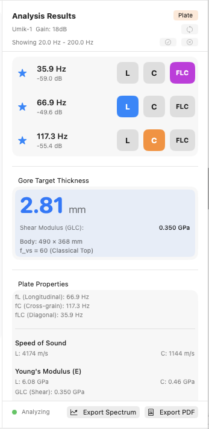
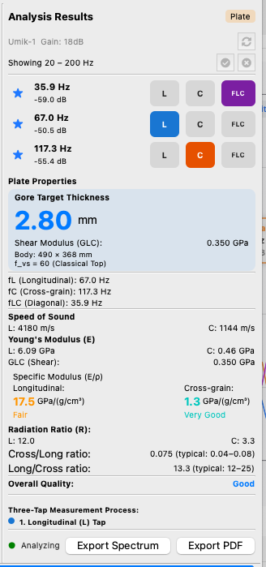
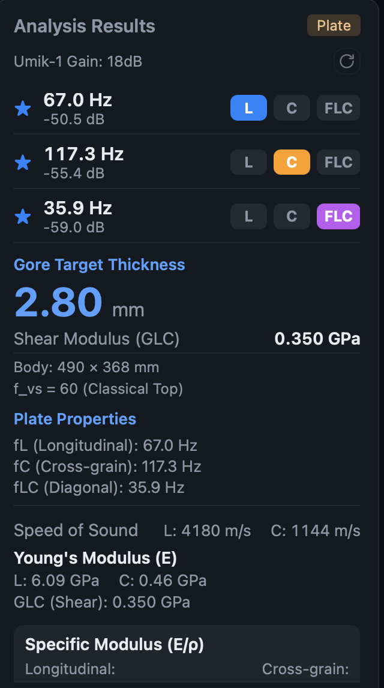

# Results panel (Analysis Results) — cross-platform consistency

**Status:** 📋 OPEN — captured 2026-07-16 from the first plate test. **No code written. Post-release.**
Not a 1.0.2 blocker: every *number* is correct and agrees across platforms (see
[MATERIAL-MULTITAP-DISCREPANCIES.md](MATERIAL-MULTITAP-DISCREPANCIES.md) — the target-thickness check
validated the algorithms). This is **presentation only**.

**Canonical = Swift** ([[project_swift_canonical]]). Precedent for this exact shape of work:
`MEASUREMENT-DETAILS-CONSISTENCY.md` — the Details pane had diverged across all three, was spec'd, then
implemented three-way (2026-06-25). Do the same here: **spec first, then all three together**
([[feedback_improvements_all_three_platforms]]).

## Evidence — the screenshots are committed alongside this doc

Three captures of the **same completed plate measurement**, one per platform (user, 2026-07-16). They
are the primary evidence for everything below — **keep them with this file**; unlike the `.guitartap`
and `.wav` files in `~/Documents/GuitarTap`, these are not reproducible after the next test run.

| platform | screenshot | shows |
|---|---|---|
| **Swift** (canonical) | [`images/results-panel-plate-swift-2026-07-16.png`](images/results-panel-plate-swift-2026-07-16.png) | fL 66.9, 2.81 mm, L 4174 m/s · `Showing 20.0 Hz - 200.0 Hz` |
| **Python** | [`images/results-panel-plate-python-2026-07-16.png`](images/results-panel-plate-python-2026-07-16.png) | fL 67.0, 2.80 mm, L 4180 m/s · `Showing 20 – 200 Hz` · the only FULL-panel capture |
| **Web** | [`images/results-panel-plate-web-2026-07-16.png`](images/results-panel-plate-web-2026-07-16.png) | fL 67.0, 2.80 mm · dark theme · no `Showing` row |

The fL / thickness differences visible between them (66.9 vs 67.0; 2.81 vs 2.80) are **STATUS item 4's
first-tap gated-window defect — not a panel issue.** See
[MATERIAL-MULTITAP-DISCREPANCIES.md](MATERIAL-MULTITAP-DISCREPANCIES.md) §3.

⚠ **This is NOT a "the web drifted" story.** The divergences point in **three different directions** —
the web is wrong on order/boxing/colour, Python is wrong on nesting/spacing, and **Swift and Python
disagree with each other** on the "Showing" format. Any fix pass must check all three, not just re-skin
the web.

## The divergences

### 1. Peak row ORDER — web diverges ✅ code-confirmed

| | order | renders as |
|---|---|---|
| Swift | ascending **frequency** | 35.9, 66.9, 117.3 |
| Python | ascending **frequency** | 35.9, 67.0, 117.3 |
| **Web** | **phase order (L→C→FLC)** | **67.0, 117.3, 35.9** |

- Swift `TapAnalysisResultsView.swift:410` — `.sorted { $0.peak.frequency < $1.peak.frequency }`, and
  the doc comment at `:28` says *"lists all `currentPeaks` sorted by frequency"*.
- Python `tap_analysis_results_view.py:535` — *"Visible (selected) peaks, sorted by frequency"*.
- Web `MaterialResults.tsx:138-144` — builds `slots` as `[{role:'L'},{role:'C'},{role:'FLC'}]` and
  `slots.map(...)`s them straight out. **No sort.**

All three show the same L/C/FLC badges, so **only the order differs**. Note the web's slot array is
what drives the fixed dashed placeholder rows during live capture
([[project_material_results_phased_display]]) — so the fix must keep the slot model for the *capturing*
state while sorting by frequency once complete. Check what Swift does during capture before changing it.

### 2. "Showing …" range row — THREE-way divergence ✅ code-confirmed

| | renders | source |
|---|---|---|
| Swift | `Showing 20.0 Hz - 200.0 Hz` — hyphen, unit on **both**, 1 dp | `TapAnalysisResultsView.swift:220` `Text("Showing \(minFreq.formattedAsFrequency()) - \(maxFreq.formattedAsFrequency())")` |
| Python | `Showing 20 – 200 Hz` — en-dash, unit **once**, 0 dp | `tap_tone_analysis_view.py:1178` `f"Showing {fmin} – {fmax} Hz"` |
| **Web** | **absent entirely** | no such string anywhere in `src/` |

The web is missing **the whole row**, which also means it has no **Select All / Deselect All** controls
(the ✓/⊗ icons Swift and Python show at the row's right). Decide whether the web needs the row, the
controls, or both.

### 3. Gore Target Thickness — section NESTING — Python diverges

- **Swift + web:** `Gore Target Thickness` is its **own section, first**; then a separate
  `Plate Properties` section holds fL / fC / fLC.
- **Python:** `Plate Properties` is the **outer header**, with the Gore box **inside** it, then
  fL / fC / fLC.

### 4. Gore Target Thickness — BOXING — web diverges

Swift and Python render it as a **tinted box**; the web uses a plain coloured text header with **no
panel**.

### 5. Label/line treatment — web diverges (user)

> *"Speed of sound is a line of its own and bold in swift but on the same line as the values with no
> bold in web."*

- **Swift:** `Speed of Sound` is its **own bold line**; `L: 4174 m/s` / `C: 1144 m/s` sit beneath it.
- **Web:** collapses to **one line** — `Speed of Sound   L: 4180 m/s   C: 1144 m/s` — and the label is
  **not bold**.

⚠ **Treat as systemic, not one row.** The web's `Young's Modulus (E)` *is* bold-on-its-own-line while
`Speed of Sound` isn't, so the web is inconsistent **with itself** as well as with Swift. Audit **every**
section label (Speed of Sound, Young's Modulus, Specific Modulus, Radiation Ratio, Overall Quality, …)
and derive one rule from Swift rather than patching the one row that was noticed.

### 6. Colour used for titles — web diverges (user)

> *"Web is using color for some 'titles' while swift does not."*

The web renders `Gore Target Thickness` and `Plate Properties` as **blue** headings; Swift uses plain
text for both. Note the web applies it **selectively** — those two are blue while `Speed of Sound` and
`Young's Modulus (E)` are not — so there is no consistent rule on the web today.

⚠ **Overlaps [THEME-SPEC.md](THEME-SPEC.md) (STATUS item 3).** The **systemBlue token** is exactly that
work's seam ([[project_theme_light_dark]]). Settle *"are section titles ever coloured?"* **with** the
theme work or the two efforts will fight over the same pixels.

### 7. Vertical spacing / density — Python diverges (user)

> *"Python spacing (vertically) is more cramped than swift and web."*

Python's rows sit tighter than Swift's and the web's — visible in the screenshots, and consistent with
Python being the **only** platform whose whole panel fits without scrolling (Swift's cuts off at Young's
Modulus, the web's at Specific Modulus). Needs a measured target from Swift (Qt layout spacing/margins),
not eyeballing.

## NOT compared — the screenshots are cut off at different points

**Everything from `Specific Modulus` down is unverified.** Python's screenshot shows the full panel
(Specific Modulus values with quality colours, Radiation Ratio, Cross/Long + Long/Cross ratios, Overall
Quality, Three-Tap Measurement Process); Swift's stops at Young's Modulus; the web's stops at the
Specific Modulus header. **Get scrolled-down captures of all three before spec'ing** — do not assume
those sections agree.

## Explicitly NOT divergences

- **The web's dark theme.** That is [THEME-SPEC.md](THEME-SPEC.md) / STATUS item 3, not this.
- **Badge hues** (L blue / C orange / FLC purple) — consistent across all three; only shade differs,
  which is theme.
- **fL 66.9 vs 67.0 and 2.81 vs 2.80 mm** — STATUS item 4's first-tap gated-window defect. The numbers
  and algorithms are correct; see MATERIAL-MULTITAP-DISCREPANCIES.md §3.

## Before fixing

1. **Spec it first**, against Swift, from scrolled-down screenshots of all three. Same approach that
   worked for `MEASUREMENT-DETAILS-CONSISTENCY.md`.
2. **Coordinate with the theme work** (item 3) — divergence 6 is a theme question wearing a layout
   costume.
3. **Consider folding into the view-layer restructure** ([[project_architectural_restructure]], STATUS
   item 2). This panel is the view layer, and *"every web defect is the presentation layer re-deriving
   what Swift's model owns"* is the recurring theme of this whole cycle — divergence 1 (the web
   re-deriving row order instead of taking the model's sorted peaks) is precisely that pattern again.
4. Tests: order (1) and the "Showing" string (2) are testable as pure functions. Boxing/spacing/colour
   (4–7) are visual — the realistic guard is the spec plus a run-review.